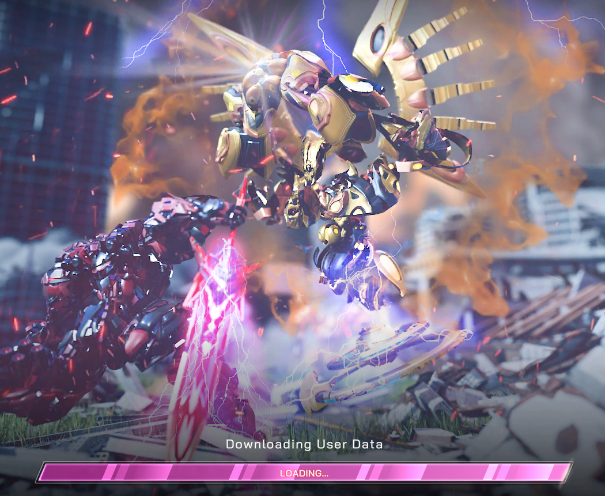
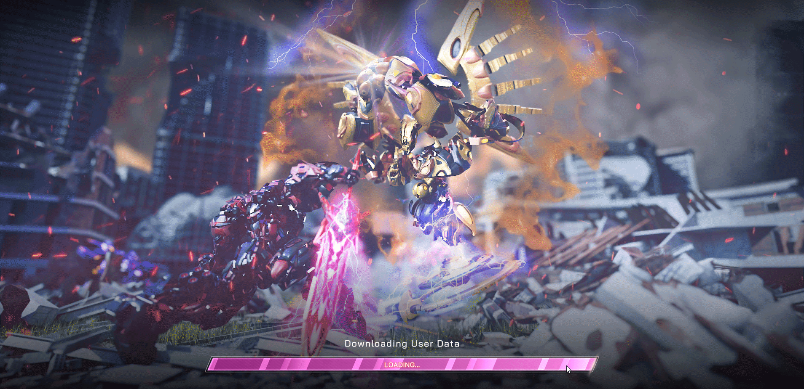

# [Mech Master](https://mechmaster.io/) - [Public Testnet](https://app.mechmaster.io/#/beta-testing-event) Feedbacks and [Bug Reports](https://docs.google.com/forms/d/e/1FAIpQLSfzVRnz5X3jwkpQUp91PRkywLLcGz4rXita7jHucglejoIZMA/viewform)

# Technical environment

|Name|Value|
|:---|:---:|
|OS|Windows 10 Pro 1909 18363.1500 x64|
|CPU|QuadCore Intel Core i5-4570, 3400 MHz (34 x 100)|
|RAM 1|Samsung M378B1G73EB0-CK0	8 GB DDR3-1600|
|RAM 2|Samsung M378B1G73EB0-CK0	8 GB DDR3-1600|
|RAM 3|Corsair Vengeance CMZ16GX3M2A1600C10	8 GB DDR3-1600|
|RAM 4|Corsair Vengeance CMZ16GX3M2A1600C10	8 GB DDR3-1600|
|Video Adapter|NVIDIA GeForce GTX 970 (4 GB)|
|Monitor|LG FullHD (1920x1080)|
|Browser|Yandex Browser 22.3.0.2430 (64-bit)|

# Founded bugs

## Common

|#|Part|Description|Date (dd.MM.yyyy HH:mm UTC+0)|Screensoots|Solved|
|-|:--:|:----------|:---------------------------:|:---------:|:----:|
|1|Starting the game|At the start of the game, data is endlessly loaded, the game does not enter|30.03.2022 17:00||:x: Nope|
|2|Starting the game|Funny bug - I can change the value of the loading progressbar by moving it with the mouse.|30.03.2022 17:00||:x: Nope|
|3|Starting the game|When "Downloading user data" I can press the ESC button and progressbar is hide.|30.03.2022 17:37||:x: Nope|
|4||||||
|5||||||
|6||||||
|7||||||

## Match-making

|#|Part|Description|Date (dd.MM.yyyy HH:mm UTC+0)|Screensoots|Solved|
|-|:--:|:----------|:---------------------------:|:---------:|:----:|
|1||||||

## Equipping

|#|Part|Description|Date (dd.MM.yyyy HH:mm UTC+0)|Screensoots|Solved|
|-|:--:|:----------|:---------------------------:|:---------:|:----:|
|1||||||

## Battling

|#|Part|Description|Date (dd.MM.yyyy HH:mm UTC+0)|Screensoots|Solved|
|-|:--:|:----------|:---------------------------:|:---------:|:----:|
|1||||||

# Suggestions

1. 